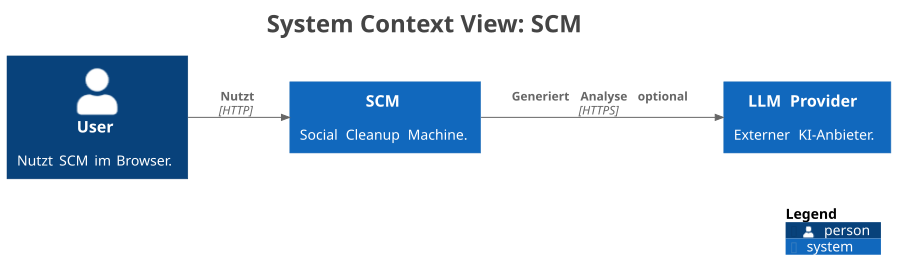

# Systemkontext und -abgrenzung

## Systemabgrenzung

SCM umfasst im MVP das Frontend, die Backend-API und die lokale Persistenz der Analyse-Runs. Innerhalb dieser Systemgrenze nimmt das System vom Nutzer bereitgestellten Social-Media- oder Problemtext entgegen, führt eine strukturierte Analyse-Pipeline aus, validiert die Ergebnisstruktur und speichert beziehungsweise lädt Runs mit ihren Metadaten.

SCM ist dabei ein Analyse- und Unterstützungswerkzeug. Das System strukturiert Eingaben, macht Verarbeitungszustände sichtbar und liefert einen fachlich vorbereiteten Analysevorschlag. Es trifft jedoch keine autonomen Entscheidungen über Personen, Situationen oder organisatorische Massnahmen und ersetzt keine menschliche Beurteilung.

## Kontextdiagramm (C1)

Die C1-Sicht ist als Structurizr-Quelle in [docs/diagrams/structurizr/c1-system-context.dsl](../diagrams/structurizr/c1-system-context.dsl) dokumentiert und als SVG in [docs/diagrams/rendered/c1-system-context.svg](../diagrams/rendered/c1-system-context.svg) gerendert.

Die C1-Sicht zeigt SCM als ein System innerhalb einer bewusst engen Systemgrenze. Innerhalb dieser Grenze liegen Web UI, Backend/API und lokale Persistenz; ausserhalb liegen die menschliche Nutzung und der optionale externe LLM Provider. Diese Sicht ist wichtig, weil sie die KI-Abhängigkeit nicht als internes Detail versteckt, sondern als bewusst benanntes Umsystem ausweist.

| Element | Rolle im Kontext | Wichtige Hinweise |
| --- | --- | --- |
| `User` | Primärer Akteur | Erfasst Problemtexte, startet Analysen und prüft Resultate. |
| `SCM` | System of Interest | Enthält Web UI, Backend/API und lokale Persistenz innerhalb der Systemgrenze. |
| `LLM Provider` | Externes Umsystem | Wird nur im optionalen OpenAI-Pfad über den Adapter angesprochen. |

Primärer Akteur ist der `User`. Er gibt den fachlichen Ausgangstext über die SCM-Oberfläche ein, startet damit einen Analyse-Run und liest die erzeugten Resultate, Statusanzeigen und Fehlermeldungen wieder aus dem System.

Auf Ebene des Systemkontexts erscheint `SCM` bewusst als Blackbox. Frontend, Backend und lokale Persistenz gehören innerhalb dieser Abstraktion zur internen Systemgrenze und werden nicht als eigene Umsysteme modelliert. Potenziell datenschutzsensitiver Freitext gelangt damit zuerst in das Gesamtsystem und erst danach in die interne Verarbeitungskette aus UI, API, Validierung und Persistenz.

Daten verlassen die lokale Systemgrenze nur dort, wo `SCM` über den internen Adapter ein externes `LLM Provider API` anspricht. Dieser Schritt ist optional konfiguriert und macht den KI-Anbieter zu einer bewusst benannten externen Abhängigkeit. Die Resultate fliessen anschliessend zurück an den `User`; der letzte Interpretations- und Entscheidungsschritt bleibt ausdrücklich beim Menschen.

## Kontext und Verantwortung

Die Systemgrenze von SCM endet bei der lokalen UI/API/DB-Kombination. Browser-Nutzung, menschliche Interpretation der Analyse und ein optional angebundener externer KI-Anbieter bilden den relevanten Umgebungskontext ausserhalb dieser Grenze.

Für Datenschutz-, Transparenz- und Governance-Annahmen ergänzt [docs/privacy-and-ai-governance.md](../privacy-and-ai-governance.md) dieses Kapitel. Das Zusatzdokument vertieft insbesondere Datenarten, externe Empfänger und MVP-Grenzen, während arc42 die primäre Architekturerzählung bleibt.

## Schnittstellen und Integrationspunkte (MVP-Stand)

Aus Sicht der SCM-Systemgrenze sind die Nutzung über den Browser und der optionale LLM-Provider externe Schnittstellen. UI, API und Persistenz liegen innerhalb des Systems; ihre Verbindungen sind trotzdem architekturrelevant, weil sie die wichtigsten Verträge und Datenflüsse des MVP tragen.

### Externe Schnittstellen

| Schnittstelle | Protokoll / Vertrag | Übertragene Daten | Zentrale Risiken |
| --- | --- | --- | --- |
| User zu SCM | Browserbasierte Nutzung der Weboberfläche; fachlicher Vertrag über sichtbare Eingabe-, Analyse-, Archiv- und Exportfunktionen | Problemtext, Nutzerinteraktion, sichtbare Analyse- und Fehlerresultate | Fehlinterpretation der Analyse als objektive Wahrheit, Eingabe sensibler Inhalte, unklare Verantwortung bei Weiterverwendung |
| API zu LLM Provider | HTTPS über Adapter-Port; im OpenAI-Pfad Responses API mit Prompt v2 und angefordertem JSON Schema | Problemtext, erkannte Sprache, aktiver Prompt, JSON-Schema-Anforderung und Provider-Metadaten | Datenschutz, Verfügbarkeit, Latenz, Modell- und Formatdrift |

### Wichtige interne Integrationspunkte

| Integrationspunkt | Protokoll / Vertrag | Übertragene Daten | Zentrale Risiken |
| --- | --- | --- | --- |
| UI zu API | HTTP/JSON über API v1 und FastAPI-OpenAPI-Vertrag | `input_text`, Run-Responses, Fehlervertrag, Metadaten und JSON-Exportdaten | Validierung, stabile Fehlersemantik, sichtbare `correlation_id` |
| API zu DB | SQLAlchemy ORM, Alembic-Migrationen und relationales Schema `runs` | Runs, Analyse-JSON, Validierungsreport, Sprach- und Traceability-Metadaten | Migrationsdrift, Persistenzfehler, Datenaufbewahrung ohne fachliche Löschfunktion |
