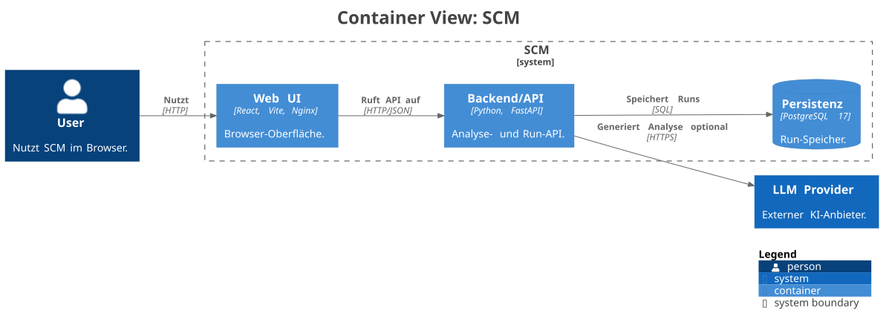
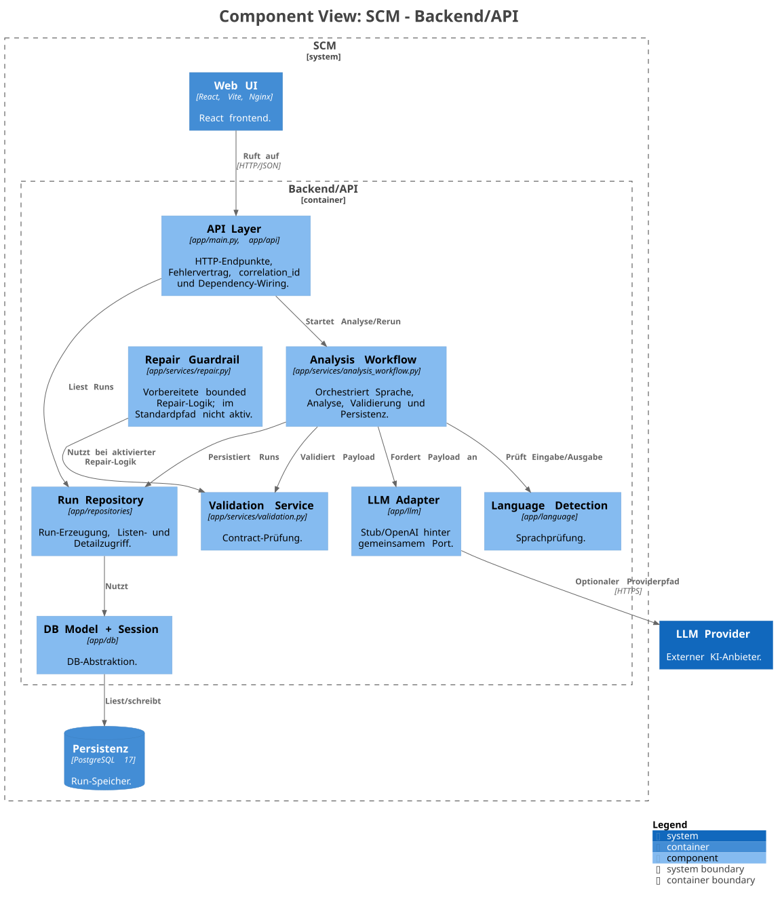
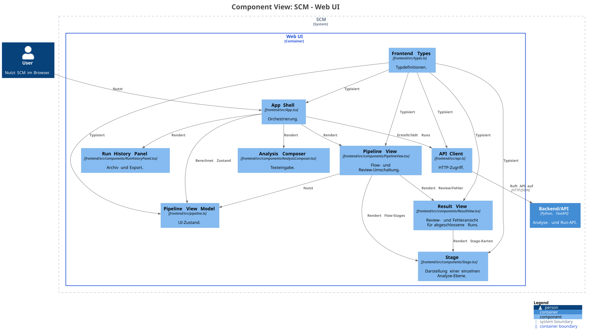

# 05 Bausteinsicht

## Level-1-Zerlegung

Die C2-Containersicht ist als Structurizr-Quelle in [docs/diagrams/structurizr/c2-scm-container.dsl](../diagrams/structurizr/c2-scm-container.dsl) dokumentiert und als SVG in [docs/diagrams/rendered/c2-scm-container.svg](../diagrams/rendered/c2-scm-container.svg) gerendert.

Die C2-Sicht trennt die interne SCM-Laufzeit in `Web UI`, `Backend/API` und `Persistenz`. Der externe `LLM Provider` bleibt ausserhalb der SCM-Systemgrenze und wird nur vom Backend/API-Container über den Adapterpfad angesprochen.

| Container / Umsystem | Verantwortung | Technologie / Fundstelle |
| --- | --- | --- |
| `Web UI` | Texteingabe, Analyseansicht, Archiv, Metadaten und JSON-Export | React/Vite/Nginx, `frontend/` |
| `Backend/API` | Analyse-API, Orchestrierung, Validierung, Sprachprüfung, Persistenzzugriff | FastAPI/SQLAlchemy, `backend/app/` |
| `Persistenz` | Speicherung von Runs, Validierungsreport und Traceability-Metadaten | PostgreSQL im Compose-Betrieb |
| `LLM Provider` | Optionale externe Analyseerzeugung | OpenAI Responses API über `backend/app/llm/openai_adapter.py` |

Die Bausteine bilden eine einfache Verarbeitungskette: Die Web UI nimmt Problemtexte entgegen und zeigt Analyse- sowie Archivsicht. Das Backend stellt die API bereit, orchestriert den Analysepfad und kapselt den optionalen Provider-Zugriff. Die Persistenz speichert Runs, Validierungsreport und Traceability-Metadaten. Der externe LLM Provider bleibt ausserhalb der Systemgrenze und liefert nur im entsprechend konfigurierten Pfad generierte Analyseinhalte.

## Verantwortlichkeiten

Die UI übernimmt Präsentation und Nutzerinteraktion. Die API stellt Verträge, Orchestrierung, Fehlermapping und Persistenzzugriff bereit. Die Persistenz sorgt für eine dauerhafte, abfragbare Run-Historie. Der LLM-Provider liefert generierte Analyseinhalte, die erst nach strikten Contract-Checks in den weiteren Verarbeitungspfad gelangen.

Der zentrale Analysevertrag folgt der fachlichen Quelle in `docs/scm.md`. Neue Analyse-Runs müssen deshalb die sechs Ebenen `symptome`, `ursachen`, `emotionen`, `narrative`, `mythen` und `essenz` liefern. Alte Payload-Formate werden von den Bausteinen nicht rückwärtskompatibel unterstützt.

## Backend-Zerlegung (Level 2)

Die C3-Komponentensicht des Backends ist als Structurizr-Quelle in [docs/diagrams/structurizr/c3-backend-components.dsl](../diagrams/structurizr/c3-backend-components.dsl) dokumentiert und als SVG in [docs/diagrams/rendered/c3-backend-components.svg](../diagrams/rendered/c3-backend-components.svg) gerendert.

| Komponente | Verantwortung | Fundstelle |
| --- | --- | --- |
| `API Layer` | HTTP-Endpunkte, Requestvalidierung, Fehlervertrag und `correlation_id` | `backend/app/main.py`, `backend/app/api/` |
| `Analysis Workflow` | Orchestriert Sprache, Analyseerzeugung, Validierung, Ausgabesprachprüfung und Persistenz | `backend/app/services/analysis_workflow.py` |
| `Language Detection` | Lokale Sprachdetektion für `de`, `fr`, `en` mit Confidence-Schwelle | `backend/app/language/` |
| `Validation Service` | JSON-Schema- und Pydantic-Prüfung mit strukturiertem Report | `backend/app/services/validation.py` |
| `LLM Adapter` | Stub- und OpenAI-Pfad hinter gemeinsamer Generator-Schnittstelle | `backend/app/llm/` |
| `Run Repository` | Erstellen, Laden und Listen persistierter Runs | `backend/app/repositories/` |
| `DB Model + Session` | SQLAlchemy-Modell, Engine und Session Factory | `backend/app/db/` |
| `Repair Guardrail` | Vorbereitete bounded Repair-Logik, nicht im Standardpfad aktiv | `backend/app/services/repair.py` |

Die Backend-Komponenten trennen HTTP-Vertrag, fachlichen Workflow, Validierung, Providerzugriff und Persistenz bewusst voneinander. Dadurch bleibt der zentrale Analysepfad nachvollziehbar: Die API nimmt Requests entgegen und ordnet Fehler dem Fehlervertrag zu, der Workflow koordiniert Sprache, Analyse, Validierung und Speicherung, und Repository- sowie DB-Schicht kapseln den Zugriff auf persistierte Runs.

## Frontend-Zerlegung (aktueller Stand)

Die C3-Komponentensicht der Web UI ist als Structurizr-Quelle in [docs/diagrams/structurizr/c3-web-ui-components.dsl](../diagrams/structurizr/c3-web-ui-components.dsl) dokumentiert und als SVG in [docs/diagrams/rendered/c3-web-ui-components.svg](../diagrams/rendered/c3-web-ui-components.svg) gerendert.

| Komponente | Verantwortung | Fundstelle |
| --- | --- | --- |
| `App Shell` | Top-Level-Tabs, Run-Auswahl, Analysezustand, Fehlerzustand und Orchestrierung | `frontend/src/App.tsx` |
| `Analysis Composer` | Eingabeformular und Start einer neuen Analyse | `frontend/src/components/AnalysisComposer.tsx` |
| `Pipeline View` | Darstellung von Flow- und Review-Modus der sechs Ebenen | `frontend/src/components/PipelineView.tsx` |
| `Run History Panel` | Archiv, Metadaten, JSON-Export und bewusstes Öffnen in Analyse | `frontend/src/components/RunHistoryPanel.tsx` |
| `API Client` | HTTP-Zugriff auf Analyse-, Listen- und Detail-Endpunkte | `frontend/src/api.ts` |
| `Pipeline View Model` | Deterministische Ableitung von UI-Zuständen aus Run, Loading und Reveal Token | `frontend/src/pipeline.ts` |
| `Frontend Types` | Typen für Run, Analyse-JSON und Pipeline-Viewmodelle | `frontend/src/types.ts` |

- `App.tsx` orchestriert Texteingabe, API-Aufrufe, Run-Selektion, Workspace-Tabs (`Analyse`/`Archiv`), Export und den globalen Fehlerzustand.
- `AnalysisComposer` kapselt die Eingabemaske für den Rohtext und den Start der Analyse.
- `usePipelineViewModel` in `frontend/src/pipeline.ts` transformiert den gewählten Run in einen deterministischen UI-Zustand mit den Modi `idle`, `submitting`, `result_received`, `revealing`, `completed` und `failed`.
- `PipelineView` rendert die zwei Frontend-Betriebsarten der Filterstrecke:
  - Flow-Modus während `submitting`/`result_received`/`revealing` mit genau einer sichtbaren aktiven Stage
  - Review-Modus nach `completed` mit allen sechs Stages, optionalen Details und hervorgehobener `Essenz`
- `RunHistoryPanel` entkoppelt die Auswahl bereits persistierter Runs von der Pipeline-Darstellung und bündelt im Archiv-Tab Run-Liste, technische Nachweise, JSON-Export und die explizite Aktion zum Öffnen eines Runs in der Analyseansicht.

Die Frontend-Logik trennt damit bewusst zwischen Datenbeschaffung (`App.tsx`), Zustandsableitung (`usePipelineViewModel`) und visueller Darstellung (`AnalysisComposer`, `PipelineView`, `RunHistoryPanel`). Die Pipeline-Stages sind zentral in `frontend/src/pipeline.ts` definiert, damit Reihenfolge, Titel und Prompt-Texte nicht über mehrere Komponenten verstreut gepflegt werden müssen. Die UI behandelt den laufenden Analysepfad bewusst anders als die spätere Run-Prüfung: während des Reveal wird nur eine Stage fokussiert dargestellt, nach Abschluss bleibt der gesamte Run als reviewbare Übersicht sichtbar.

Die Web-UI-C3-Sicht dokumentiert diese Trennung explizit: App-Orchestrierung, API Client, Pipeline-Zustandsableitung, Eingabe-Komponente und Archiv-/Export-Komponente sind eigene Verantwortungsbereiche, obwohl sie gemeinsam als eine React-SPA ausgeliefert werden.
