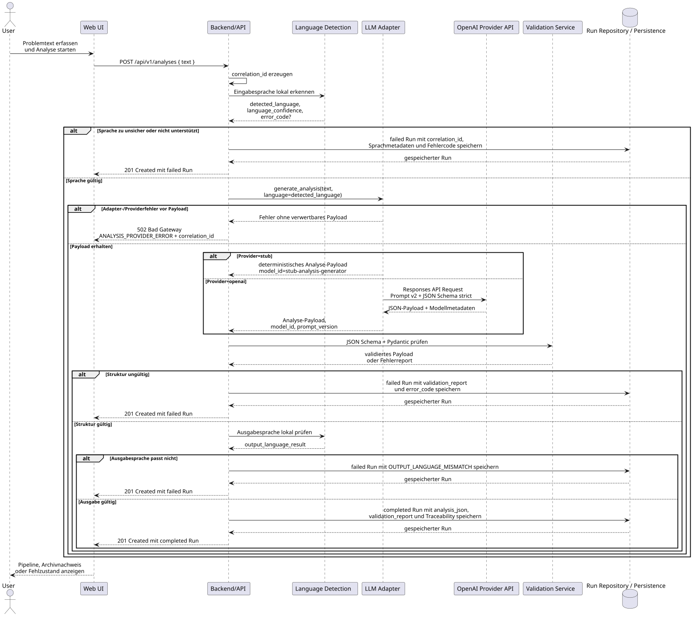

# 06 Laufzeitsicht

## Szenario 1: Verfügbarkeitsprüfung des Backends

Die Verfügbarkeitsprüfung ist der kleinste Laufzeitpfad des Systems. Sie dient als technische Start- und Betriebsprüfung der API.

1. Ein Client ruft `GET /health` am Backend auf.
2. Die FastAPI-Anwendung nimmt die Anfrage ohne weitere Abhängigkeiten entgegen.
3. Das Backend antwortet mit HTTP `200`.
4. Der Response-Body ist `{"status":"ok"}`.

## Szenario 2: Analyse eines Problemtexts via API v1

Der API-Vertrag wird zur Laufzeit von FastAPI als OpenAPI-Schema bereitgestellt. Zusätzlich ist der aktuelle Snapshot unter `docs/api/openapi.json` versioniert; `backend/scripts/export_openapi.py` erzeugt dieses Artefakt reproduzierbar aus `create_app().openapi()`.

Die folgende textuelle Abfolge wird zusätzlich durch das UJ1-Sequenzdiagramm visualisiert.

Die Quelle liegt in [docs/diagrams/uj1-sequence.puml](../diagrams/uj1-sequence.puml), das gerenderte SVG in [docs/diagrams/rendered/uj1-sequence.svg](../diagrams/rendered/uj1-sequence.svg).

Das Sequenzdiagramm unterscheidet bewusst zwischen Fehlerläufen und erfolgreichen Läufen. Auch Fehlerläufe werden persistiert, damit Sprachfehler, strukturelle Validierungsfehler und Ausgabesprachfehler später nachvollziehbar bleiben. Ein Repair-Schritt ist als Guardrail vorbereitet, aber nicht Teil dieses Standardablaufs. Technische Adapter- oder Providerfehler vor einem verwertbaren Analyse-Payload sind davon getrennt: Sie gehören im aktuellen MVP zum technischen API- und Betriebsfehlerpfad und werden nicht als validierter Analyse-Run modelliert.

1. Ein Client sendet `POST /api/v1/analyses` mit einem Problemtext.
2. Das Backend erkennt zuerst lokal die dominante Sprache und bewertet die Sicherheit der Erkennung.
3. Bei zu geringer Sicherheit oder nicht unterstützter Sprache endet der Lauf sofort als `failed`; ein Run mit Fehlercode und Sprachmetadaten wird trotzdem persistiert.
4. Bei erfolgreicher Spracherkennung übergibt das Backend die erkannte Sprache explizit an den konfigurierten Analyse-Adapter. Im Produktivpfad ist dies der OpenAI-Adapter, alternativ bleibt ein Stub-Pfad für Offline-Tests verfügbar.
5. Der Adapter fordert die sechs Ebenen `symptome`, `ursachen`, `emotionen`, `narrative`, `mythen` und `essenz` im versionierten SCM-Vertrag aus `docs/scm.md`, `prompts/v2/analysis.md` und `schemas/analysis.schema.json` an. Zusätzlich übergibt das Backend die erkannte Eingabesprache als explizite Prompt-Vorgabe.
6. Wenn der Adapter ein verwertbares Payload liefert, validiert das Backend die Analyse gegen Schema und Pydantic-Modelle.
7. Bei gültiger Struktur prüft das Backend zusätzlich die dominante Sprache der gesamten Analyseausgabe. Bei Abweichung oder zu geringer Sicherheit endet der Lauf mit `OUTPUT_LANGUAGE_MISMATCH`.
8. Schlägt die Struktur- oder Ausgabesprachprüfung fehl, endet der aktuelle Standardpfad explizit als Fehlerlauf; eine separate bounded Repair-Logik ist im Repository vorbereitet, aber derzeit nicht in diesen Laufzeitpfad eingebunden.
9. Der Run wird mit Analyse-JSON oder Fehlerzustand, Validation-Report, Sprachmetadaten und Traceability-Feldern persistiert.
10. Die API antwortet synchron mit dem gespeicherten Run.

## Szenario 3: Retrieval und Rerun

Neben der initialen Analyse unterstützt der Laufzeitpfad das spätere Wiederfinden und bewusste Neuerzeugen von Runs. Bestehende Runs bleiben dabei unverändert.

Der Quell-Run kann erfolgreich oder fehlgeschlagen sein; Rerun ist keine Reparatur des alten Laufs, sondern ein neuer Versuch mit demselben Eingabetext.

1. Ein Client ruft `GET /api/v1/analyses` oder `GET /api/v1/analyses/{id}` auf.
2. Das Backend liest die gespeicherten Runs aus der Persistenz und liefert sie als API-Responses aus.
3. Bei `POST /api/v1/analyses/{id}/rerun` wird der ursprüngliche `input_text` erneut verarbeitet.
4. Auch beim Rerun werden Spracherkennung, Analyse und Validierung erneut durchlaufen; der aktuelle Standardpfad enthält dabei keinen aktiv verdrahteten Repair-Schritt.
5. Das System persistiert dafür einen neuen Run; der alte Run bleibt unverändert.
6. Eine Übersetzung alter Analyse-Payloads in den neuen Vertrag findet nicht statt; der aktuelle Laufzeitpfad erwartet ausschliesslich das aktive SCM-Format.

## Szenario 4: Deterministische Entfaltung im Frontend

Die Frontend-Laufzeit übersetzt einen gespeicherten Run in eine geführte Darstellung. Der Analysefluss und die spätere Review-Sicht werden dabei bewusst unterschiedlich behandelt.

1. Die Benutzerin gibt einen Problemtext im `AnalysisComposer` ein und startet die Analyse.
2. `App.tsx` sendet den Text an `POST /api/v1/analyses` und setzt den UI-Zustand währenddessen auf `loading`.
3. Nach erfolgreicher Antwort wird der neue Run als selektierter Run gesetzt und ein `revealToken` erhöht.
4. `usePipelineViewModel` erkennt den neuen Token und überführt die Anzeige zuerst in den Zustand `result_received`.
5. Danach aktiviert der Hook die sechs Stages `symptome`, `ursachen`, `emotionen`, `narrative`, `mythen` und `essenz` in fester Reihenfolge mit einem Zeitintervall.
6. `PipelineView` rendert während dieser Entfaltung einen Flow-Modus mit Fortschrittsleiste und genau einer sichtbaren aktiven Stage; abgeschlossene und zukünftige Stages erscheinen dort nur als reduzierte Timeline-Knoten.
7. Nach Abschluss wechselt die UI in einen Review-Modus: alle sechs Stages werden gleichzeitig sichtbar, Details bleiben je Stage optional aufklappbar, und die `Essenz` bleibt standardmässig geöffnet.
8. Wird stattdessen ein historischer Run aus dem Archiv-Tab geladen, zeigt das Frontend den gespeicherten Endzustand direkt im Review-Modus ohne erneute Entfaltungsanimation.
9. Schlägt die Analyse fehl oder liegt kein gültiges `analysis_json` vor, wechselt die Ansicht in einen terminalen Fehlerzustand und zeigt Fehlercode sowie Fehlertext explizit an.
