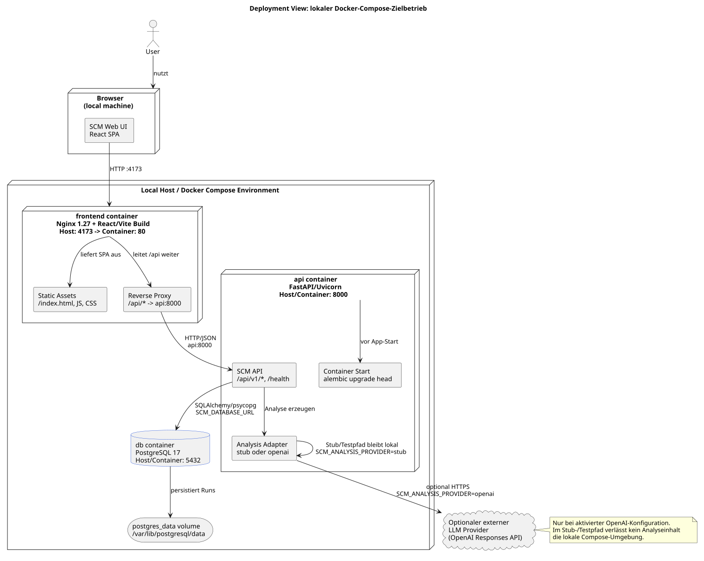

# Verteilungssicht

Die initiale Deployment-Sicht bleibt bei einem containerisierten Setup aus UI, API und PostgreSQL via Docker Compose.

Die Deployment-Sicht in [docs/diagrams/deployment-compose.puml](../diagrams/deployment-compose.puml) zeigt den lokalen Docker-Compose-Zielbetrieb mit Browser, `frontend`-, `api`- und `db`-Container, persistentem PostgreSQL-Volume sowie optionalem externem LLM Provider. Das gerenderte SVG liegt in [docs/diagrams/rendered/deployment-compose.svg](../diagrams/rendered/deployment-compose.svg).

Die Persistenz im Backend ist relational modelliert. Die API schreibt Analyse-Runs in eine `runs`-Tabelle; für den lokalen Zielbetrieb und für Compose wird PostgreSQL verwendet. Die lokalen Persistenztests laufen weiterhin mit SQLite, um den Entwicklungs- und Testloop ohne externe Datenbank schnell zu halten.

Die API bleibt der einzige Einstiegspunkt für Analysen, delegiert die eigentliche Analyseerzeugung aber an einen austauschbaren LLM-Adapter. Für lokale und Test-Nutzung kann ein Stub-Adapter ohne Netz aktiv bleiben; für reale Analysen steht eine OpenAI-basierte Implementierung zur Verfügung.

Der fachlich-technische Vertrag für erzeugte Analyse-Payloads wird in `docs/prd.md`, `schemas/analysis.schema.json`, `backend/app/models/analysis.py` und `prompts/v2/analysis.md` konkretisiert. `docs/scm.md` bleibt als ursprüngliche Projektidee und fachlicher Hintergrund erhalten. Alle Laufzeitkomponenten im Compose-Betrieb müssen denselben Vertrag für `symptome`, `ursachen`, `emotionen`, `narrative`, `mythen` und `essenz` verwenden; eine Rückwärtskompatibilität zu früheren Ebenennamen ist nicht vorgesehen.

Das Frontend ist als eigenständiger Baustein Teil dieser Verteilung. Es spricht die Backend-API direkt an, startet Analysen synchron, zeigt Runs als Pipeline an und ermöglicht im Archiv den Export des aktuell gewählten Runs als JSON.

Der lokale Zielbetrieb ist über `docker compose` konkretisiert. Die Verteilung besteht aus drei Containern:

- `frontend`: Nginx liefert das gebaute React/Vite-Frontend aus und leitet `/api` an die API weiter
- `api`: FastAPI/Uvicorn-Anwendung; führt beim Start zuerst `alembic upgrade head` aus
- `db`: PostgreSQL als relationale Persistenz für Analyse-Runs

Die Kommunikation bleibt bewusst einfach. Browserzugriffe gehen gegen das Frontend, interne API-Aufrufe laufen im Compose-Netz zwischen `frontend` und `api`, Datenbankzugriffe zwischen `api` und `db`.

Docker Compose konkretisiert diese Sicht mit Port `4173` für die Web UI, Port `8000` für die API und Port `5432` für PostgreSQL.

## Datenpfad und Deployment-Narrativ

Im MVP bleibt der primäre Betriebsmodus lokal kontrolliert. Das Frontend läuft im Browser der nutzenden Person, die API und die relationale Persistenz laufen im Compose-Setup auf derselben lokal betriebenen Umgebung. Lokal verbleiben dabei insbesondere `input_text`, `analysis_json`, `validation_report`, Sprachmetadaten sowie die Traceability-Felder des Runs in der vom Backend angebundenen Datenbank.

Eine externe Datenübertragung ist nur für die eigentliche Analyseerzeugung vorgesehen und auch dort nur unter klarer Bedingung: Wenn der produktive OpenAI-Adapter aktiviert ist, sendet die API den eingegebenen Problemtext, die erkannte Sprache, den Inhalt des aktiven Prompts und das angeforderte JSON-Schema an OpenAI. Ohne diese Konfiguration bleibt der Stub- oder Testpfad aktiv; in diesem Modus verlässt kein Analyseinhalt für die Generierung das lokale System.

Docker Compose bildet diese Trennung bewusst direkt ab. `frontend` exponiert die Weboberfläche und leitet `/api` an `api` weiter. `api` kapselt Spracherkennung, strukturelle Validierung, Persistenz und den optionalen Provider-Aufruf. Ein begrenzter Repair-Mechanismus ist im Repository vorbereitet, gehört aber im aktuellen Laufzeitpfad noch nicht zum aktiv verdrahteten Standardablauf. `db` speichert Runs und Metadaten relational. Die Compose-Zuordnung beschreibt damit nicht nur Container, sondern auch Verantwortlichkeiten und Datenflüsse zwischen lokaler UI, lokaler Anwendungslogik, lokaler Persistenz und optionalem externem KI-Dienst.

Operativ bleibt der MVP bewusst begrenzt. Nicht abgedeckt sind derzeit ein produktiver Mehrinstanzbetrieb, Backup- und Restore-Prozesse, Secret-Rotation, formalisierte Löschprozesse, mandantenfähige Isolation, Hochverfügbarkeit, zentrales Monitoring sowie ein vollständiges Incident- und Audit-Betriebsmodell. Die Verteilungssicht beschreibt damit eine nachvollziehbare lokale Zielarchitektur für Entwicklung und MVP-Betrieb, aber noch kein vollständig ausgearbeitetes Produktions-Setup.
