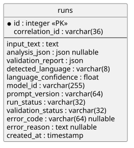

# 08 Querschnittliche Konzepte

## Analyse-Contract

Die Analyseausgabe folgt einem strikten JSON-Contract. Die fachliche Quelle dafür ist `docs/scm.md`. Die sechs Ebenen sind fest vorgegeben: `symptome`, `ursachen`, `emotionen`, `narrative`, `mythen`, `essenz`. Zusätzliche Felder sind nicht erlaubt. Vertiefte semantische Prüfungen erfolgen erst in den späteren Validierungs- und Repair-Milestones.

Jede Ebene folgt derselben Struktur mit `beschreibung` und `eintraege[].text`. Der Vertrag wird in Prompt, JSON Schema, Pydantic-Modellen, Persistenz-Payload und Frontend-Typen konsistent nachgezogen.

Der Vertragswechsel ist bewusst nicht rückwärtskompatibel. Bestehende alte Analyse-Payloads werden nicht implizit übersetzt oder aliasiert.

## Validierung und Repair

Die Backend-Validierung prüft Analyse-Payloads in zwei Stufen: zuerst gegen das JSON Schema, danach gegen die Pydantic-Modelle. Das Ergebnis ist ein strukturierter Validierungsreport mit Status, Fehlercode und Prüfschritten.

Im aktuellen Standardpfad endet ein Lauf nach einer strukturell ungültigen Payload explizit als Fehlerfall; es gibt keine stillen Fallbacks. Zusätzlich existiert im Repository eine separate bounded Repair-Logik als vorbereitete Guardrail. Diese ist auf höchstens zwei Reparaturversuche begrenzt und würde bei weiterem Scheitern explizit mit `REPAIR_LIMIT_EXCEEDED` enden, ist derzeit aber nicht im aktiven Standardpfad verdrahtet.

## Sprachdetektion

Vor jeder Analyse erkennt das Backend die dominante Sprache lokal. Aktuell werden `de`, `fr` und `en` unterstützt. Die Spracherkennung liefert immer `detected_language`, `language_confidence` und optional einen Fehlercode.

Liegt die Sicherheit unter `0.80`, endet der Lauf explizit mit `LANGUAGE_CONFIDENCE_TOO_LOW`. Wird eine Sprache ausserhalb des unterstützten Korridors erkannt, endet der Lauf mit `UNSUPPORTED_LANGUAGE`. In beiden Fällen wird kein stiller Fallback auf den LLM-Pfad versucht.

Nach erfolgreicher Eingabespracherkennung wird die erwartete Sprache explizit an den LLM-Adapter weitergegeben. Der Prompt verlangt, dass alle Felder `beschreibung` und `eintraege[].text` ausschliesslich in dieser Sprache formuliert werden und keine Sprachmischung enthalten.

Nach der strukturellen Validierung prüft das Backend zusätzlich die Sprache der gesamten Analyseausgabe. Weicht die dominierende Ausgabesprache von der zuvor erkannten Eingabesprache ab oder ist die Ausgabespracherkennung selbst zu unsicher, endet der Lauf explizit mit `OUTPUT_LANGUAGE_MISMATCH`. Dadurch wird die Produktanforderung abgesichert, dass Ausgabe- und Eingabesprache übereinstimmen.

## Persistenz

Analyse-Runs werden relational in einer einzelnen Tabelle `runs` gespeichert. Persistiert werden Eingabetext, Analyse-JSON, Validierungsreport sowie die für Nachvollziehbarkeit relevanten Metadaten wie `correlation_id`, `prompt_version`, `model_id`, `run_status`, `validation_status` und Fehlerangaben.

Das ERD bildet den aktuellen Stand der Tabelle `runs` ab. Die Quelle liegt in [docs/diagrams/db-erd.puml](../diagrams/db-erd.puml), das gerenderte SVG in [docs/diagrams/rendered/db-erd.svg](../diagrams/rendered/db-erd.svg). Es enthält neben dem Primärschlüssel `id` auch `correlation_id`, das über die Migration `20260529_01_add_correlation_id_to_runs.py` eingeführt wurde und in der API-Antwort `AnalysisRunResponse` sichtbar ist.

Schemaänderungen werden nicht implizit aus ORM-Modellen erzeugt, sondern über Alembic-Migrationen versioniert. Dadurch bleiben Datenbankstruktur und Anwendungsmodell reproduzierbar und auditiert.

## Datenschutz und KI-Governance

Die Architektur behandelt Datenschutz und KI-Governance im MVP als querschnittliche Leitplanken, nicht als nachgelagerte Formalität. Fachlich relevante Datenkategorien sind vor allem `input_text`, `analysis_json`, `validation_report`, Sprachmetadaten und technische Traceability-Metadaten. Weil der freie Eingabetext personenbezogene, sensible oder situativ heikle Inhalte enthalten kann, wird er architektonisch nicht als harmlose Testnutzlast behandelt.

Die Aufbewahrung ist im aktuellen Stand technisch nachvollziehbar, aber operativ nur begrenzt ausdefiniert. Runs bleiben lokal gespeichert, bis die zugrunde liegende Datenbank bewusst bereinigt wird. Es gibt derzeit keine fachliche Löschfunktion, keine dokumentierten Aufbewahrungsfristen pro Datenkategorie und keine vollständig ausgearbeitete Privacy-Operations-Sicht für Auskunft, Berichtigung oder Löschung.

Transparenz entsteht im MVP über offen dokumentierte Datenpfade, die sichtbare Pipeline im Frontend und die persistierten technischen Metadaten pro Run. Die Anwendung ist als unterstützendes Analysewerkzeug konzipiert; sie trifft keine autonomen Sachentscheide und ersetzt keine menschliche Beurteilung. Menschliche Aufsicht bleibt insbesondere bei der Auswahl des Eingangstexts, bei der Interpretation der Analyse und bei jeder Weiterverwendung der Resultate erforderlich.

Die aktuellen Kontrollen bleiben bewusst begrenzt. Das System beschreibt keinen vollständigen rechtlichen Compliance-Nachweis, keine produktionsreife Anbietersteuerung und keine Ende-zu-Ende-Governance für alle möglichen Einsatzkontexte. Die Architektur macht diese Grenzen explizit, statt regulatorische Vollständigkeit zu behaupten.

Als ergänzende Governance-Sicht dient [docs/privacy-and-ai-governance.md](../privacy-and-ai-governance.md).

## API-Fehlervertrag

Die API mappt fachliche und technische Fehler zentral auf einen einheitlichen Fehlervertrag. Fehlerantworten enthalten immer `code`, `message`, `details` und eine requestgebundene `correlation_id`, die bereits früh im HTTP-Lebenszyklus erzeugt und danach im Request-Kontext weitergereicht wird.

In M4 werden mindestens ungültige Requests und unbekannte Analyse-IDs explizit über diesen Vertrag beantwortet. Dadurch bleibt das Verhalten für Frontend und spätere Integrationen stabil, auch wenn sich interne Implementierungen ändern.

## LLM-Adapter und Prompt-Versionierung

Die Analyseerzeugung erfolgt nicht direkt in der API oder im Workflow-Code, sondern über einen expliziten Adapter-Port. Dadurch bleiben Stub-, Test- und Provider-Implementierungen austauschbar.

Der aktuelle Produktivpfad verwendet den OpenAI-Responses-API-Adapter mit strikt angefordertem JSON-Schema-Output. Offline-Tests injizieren weiterhin Fake- oder Stub-Adapter und führen keine Netzaufrufe aus.

Prompts werden versioniert unter `prompts/v*/` abgelegt. Der aktuelle Produktivpfad verwendet `prompts/v2/analysis.md`. Der vom Adapter verwendete `prompt_version`-Wert und die `model_id` werden in jedem Run persistiert, damit die Herkunft einer Analyse nachvollziehbar bleibt. Die jeweils aktive Prompt-Version muss die in `docs/scm.md` definierten sechs Ebenen exakt anfordern.

Der aktuelle Analyse-Prompt kombiniert dabei drei Ebenen von Leitplanken: fachliche Definitionen für jede Analyse-Ebene, strikte Strukturvorgaben des JSON-Contracts und explizite Sprachvorgaben auf Basis der zuvor erkannten Eingabesprache.

## Traceability und Laufnachvollziehbarkeit

Die Nachvollziehbarkeit eines Analyse-Runs stützt sich nicht auf ein einzelnes Feld, sondern auf die Kombination mehrerer persistierter Metadaten. `correlation_id` verbindet neue Runs mit dem auslösenden HTTP-Request. `prompt_version` zeigt, welche versionierte Prompt-Grundlage verwendet wurde. `model_id` dokumentiert den konkret eingesetzten Modellpfad. `validation_report` hält den technischen Prüfpfad über Schema-, Modell- und gegebenenfalls Sprachprüfungen fest. `run_status`, `validation_status` und `error_code` machen sichtbar, ob ein Lauf erfolgreich war, an welcher Stelle er scheiterte und ob die Struktur gültig war. `created_at` ordnet den Run zeitlich ein.

Im aktuellen Stand wird pro HTTP-Request genau eine `correlation_id` erzeugt. Dieselbe ID erscheint bei Fehlerantworten und wird bei neu erzeugten Runs mitpersistiert und über die Run-API wieder sichtbar gemacht. Dadurch ist ein kleiner, aber klarer Request-to-Run-Nachvollziehbarkeitspfad vorhanden.

Diese Felder reichen für die Nachvollziehbarkeit einzelner Runs im MVP bereits weit, bilden aber noch keinen durchgängigen Audit-Kontext über alle Schichten. Es gibt weiterhin keine vollständige Ende-zu-Ende-Korrelation über Frontend, API, Persistenz, strukturierte Logs und optionalen Provider-Pfad. Der aktuelle Ausbau verbessert somit die Laufnachvollziehbarkeit deutlich, ersetzt aber noch keine produktionsreife Observability.

## Frontend-Präsentationskonzept

Das Frontend trennt bewusst zwischen Flow- und Review-Nutzung desselben Runs. Während der synchronen Analyseantwort entfaltet die UI die bereits vollständig vorliegende Analyse deterministisch als sequentielle Filterstrecke. Dabei ist immer nur die aktive Stage als Arbeitsfläche sichtbar; andere Stages werden im Flow nur als Fortschrittsknoten oder reduzierte Zustandsmarker dargestellt.

Nach Abschluss wechselt dieselbe Analyse in einen Review-Modus. Dort werden alle sechs Stages gleichzeitig sichtbar, Details bleiben aber pro Stage standardmässig reduziert und können gezielt aufgeklappt werden. Die `Essenz` bleibt als finaler Zielpunkt standardmässig geöffnet und optisch abgesetzt. Run-Historie, JSON-Export und technische Metadaten bleiben bewusst sekundär und sind im Archiv-Kontext gebündelt, damit der primäre Fokus der Analyseansicht auf der Pipeline bleibt.

## Betriebs- und Konfigurationskonzept

Der lokale Standardbetrieb erfolgt ab M8 über Docker Compose. Konfiguration wird dabei ausschliesslich über Umgebungsvariablen injiziert; für den MVP sind insbesondere `POSTGRES_DB`, `POSTGRES_USER`, `POSTGRES_PASSWORD`, `SCM_DATABASE_URL`, `SCM_ANALYSIS_PROVIDER`, `SCM_OPENAI_MODEL` und `OPENAI_API_KEY` relevant.

Die API verwendet PostgreSQL im Compose-Betrieb als einziges Zielsystem und führt Datenbankschema-Änderungen nicht implizit über ORM-Erzeugung aus, sondern explizit über `alembic upgrade head` beim Containerstart. Dadurch bleibt der Container-Start reproduzierbar und das Schema im laufenden System entspricht der versionierten Migration-Historie.
