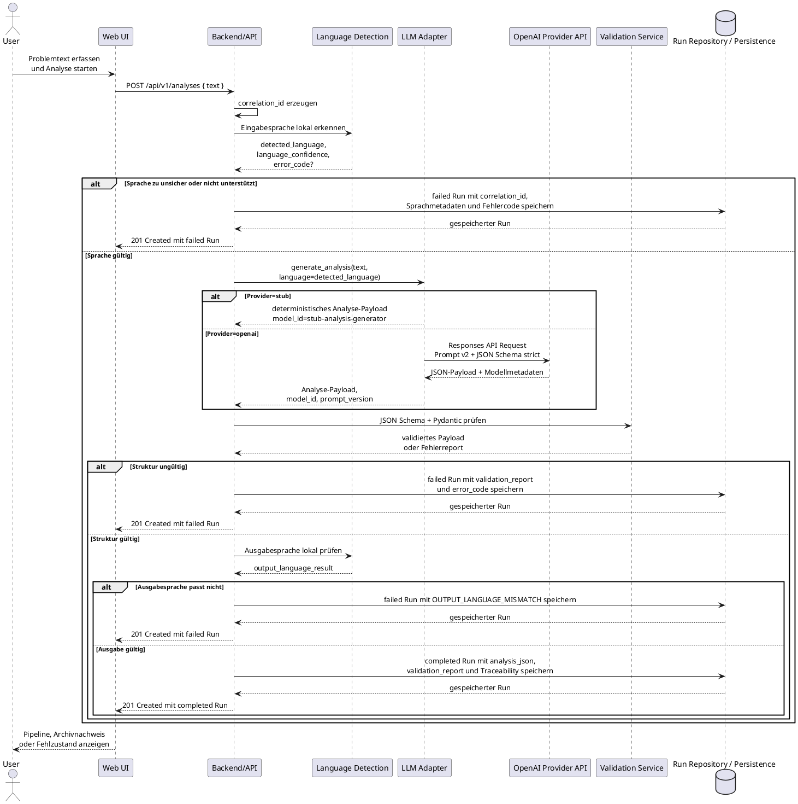

# Arc42 Diagramme Implementation Plan

> **For agentic workers:** REQUIRED SUB-SKILL: Use superpowers:subagent-driven-development (recommended) or superpowers:executing-plans to implement this plan task-by-task. Steps use checkbox (`- [ ]`) syntax for tracking.

**Goal:** Refresh the Arc42 documentation with current architecture diagrams, a corrected data model view, and current test/CI evidence without changing application code.

**Architecture:** Documentation-only change. C1/C2/C3 architecture views are represented as Structurizr DSL sources, while the UJ1 sequence and ERD remain PlantUML. Arc42 chapters reference and explain the diagram sources instead of duplicating implementation details.

**Tech Stack:** Markdown, Structurizr DSL, PlantUML, FastAPI/React/PostgreSQL repository context, `git diff --check` verification.

---

## File Structure

- Modify: `docs/test-report.md` to update the baseline commit and CI run to the current merged `main`.
- Modify: `docs/acceptance-checklist.md` to update the CI reference to the current merged `main`.
- Modify: `docs/diagrams/README.md` to list the new Structurizr DSL diagrams and updated PlantUML diagrams.
- Create: `docs/diagrams/structurizr/c1-system-context.dsl` for the C1 System Context view.
- Create: `docs/diagrams/structurizr/c2-scm-container.dsl` for the C2 Container view.
- Create: `docs/diagrams/structurizr/c3-backend-components.dsl` for Backend component view.
- Create: `docs/diagrams/structurizr/c3-web-ui-components.dsl` for Web UI component view.
- Modify: `docs/diagrams/uj1-sequence.puml` to align UJ1 with the current language/validation/output-language/persistence flow.
- Modify: `docs/diagrams/db-erd.puml` to include `correlation_id`.
- Modify: `docs/arc42/03_systemkontext_und_abgrenzung.md` to reference and explain C1.
- Modify: `docs/arc42/05_bausteinsicht.md` to reference and explain C2, C3 Backend, and C3 Web UI.
- Modify: `docs/arc42/06_laufzeitsicht.md` to reference and explain the updated UJ1 sequence.
- Modify: `docs/arc42/07_verteilungssicht.md` to align the deployment/container wording with C2 and Compose.
- Modify: `docs/arc42/08_querschnittliche_konzepte.md` to align data model text with API, ORM model, and migration.
- Modify: `docs/arc42/09_architekturentscheidungen.md` only to clarify existing ADR wording if needed; do not introduce a new ADR unless the implementation uncovers a genuinely new architecture decision.

### Task 1: Refresh Current Evidence References

**Files:**
- Modify: `docs/test-report.md`
- Modify: `docs/acceptance-checklist.md`

- [ ] **Step 1: Inspect current evidence lines**

Run:

```bash
rg -n "Baseline-Commit|CI|94e6575|26665248878|26666182368|9cfa2b9" docs/test-report.md docs/acceptance-checklist.md
```

Expected: `docs/test-report.md` still references `94e6575` and run `26665248878`; `docs/acceptance-checklist.md` references `94e6575`.

- [ ] **Step 2: Patch the evidence references**

Use `apply_patch` to change:

```md
Baseline-Commit: `94e6575`
```

to:

```md
Baseline-Commit: `9cfa2b9`
```

Change the CI sentence in `docs/test-report.md` so it references:

```md
Der aktuelle `main`-Push zu `9cfa2b9` war erfolgreich (`CI`, Run `26666182368`, 2026-05-29T22:49:54Z).
```

Change the checklist line to:

```md
- [x] GitHub Actions `CI` auf `main` für Commit `9cfa2b9`
```

- [ ] **Step 3: Verify evidence references**

Run:

```bash
rg -n "94e6575|26665248878|9cfa2b9|26666182368" docs/test-report.md docs/acceptance-checklist.md
```

Expected: only `9cfa2b9` and `26666182368` remain in these two files.

- [ ] **Step 4: Commit evidence refresh**

Run:

```bash
git add docs/test-report.md docs/acceptance-checklist.md
git commit -m "docs: update current evidence references"
```

Expected: commit succeeds with only the two evidence files.

### Task 2: Add Structurizr C1 and C2 Diagrams

**Files:**
- Create: `docs/diagrams/structurizr/c1-system-context.dsl`
- Create: `docs/diagrams/structurizr/c2-scm-container.dsl`
- Modify: `docs/diagrams/README.md`

- [ ] **Step 1: Create the Structurizr directory**

Run:

```bash
mkdir -p docs/diagrams/structurizr
```

Expected: directory exists.

- [ ] **Step 2: Add C1 System Context DSL**

Use `apply_patch` to create `docs/diagrams/structurizr/c1-system-context.dsl`:

```dsl
workspace "SCM C1 System Context" "System context for the Social Cleanup Machine MVP" {
    model {
        user = person "User" "Gibt Problemtexte ein, startet Analysen und prüft Ergebnisse."

        scm = softwareSystem "SCM" "Social Cleanup Machine: strukturiert Problemtexte in sechs Analyseebenen und persistiert nachvollziehbare Runs."

        llmProvider = softwareSystem "LLM Provider" "Externer KI-Anbieter für die optionale Analyseerzeugung im OpenAI-Pfad." {
            tags "External"
        }

        user -> scm "Nutzt über Webbrowser" "HTTP"
        scm -> llmProvider "Sendet Problemtext, erkannte Sprache, Prompt und JSON-Schema, wenn Provider=openai" "HTTPS"
    }

    views {
        systemContext scm "C1-System-Context" {
            include *
            autoLayout lr
        }

        styles {
            element "Person" {
                shape person
                background "#1f2937"
                color "#ffffff"
            }
            element "Software System" {
                background "#0f766e"
                color "#ffffff"
            }
            element "External" {
                background "#92400e"
                color "#ffffff"
            }
        }
    }
}
```

- [ ] **Step 3: Add C2 Container DSL**

Use `apply_patch` to create `docs/diagrams/structurizr/c2-scm-container.dsl`:

```dsl
workspace "SCM C2 Container" "Container view for the Social Cleanup Machine MVP" {
    model {
        user = person "User" "Gibt Problemtexte ein und prüft Analyse-Runs."

        llmProvider = softwareSystem "LLM Provider" "Externer KI-Anbieter für den optionalen OpenAI-Pfad." {
            tags "External"
        }

        scm = softwareSystem "SCM" "Social Cleanup Machine" {
            web = container "Web UI" "React/Vite SPA, statisch über Nginx ausgeliefert. Zeigt Analyse, Archiv, Metadaten und JSON-Export." "React, Vite, Nginx"
            api = container "Backend/API" "FastAPI-Anwendung für Analyse, Run-Liste, Detailabruf, Rerun, Validierung, Sprachprüfung und Persistenzzugriff." "Python, FastAPI, SQLAlchemy"
            db = container "Persistenz" "Relationale Speicherung von Analyse-Runs, Validierungsreport und Traceability-Metadaten." "PostgreSQL 17"
        }

        user -> web "Nutzt" "HTTP"
        web -> api "Ruft API auf" "HTTP/JSON, /api/v1/analyses"
        api -> db "Speichert und lädt Runs" "SQLAlchemy/Alembic"
        api -> llmProvider "Fordert Analyse-Payload an, wenn Provider=openai" "HTTPS, Responses API"
    }

    views {
        container scm "C2-SCM-Container" {
            include *
            autoLayout lr
        }

        styles {
            element "Person" {
                shape person
                background "#1f2937"
                color "#ffffff"
            }
            element "Container" {
                background "#2563eb"
                color "#ffffff"
            }
            element "Database" {
                shape cylinder
                background "#166534"
                color "#ffffff"
            }
            element "External" {
                background "#92400e"
                color "#ffffff"
            }
        }
    }
}
```

- [ ] **Step 4: Update diagram README for C1/C2**

Use `apply_patch` to add these bullets under available diagram sources:

```md
- `docs/diagrams/structurizr/c1-system-context.dsl`: C1-Systemkontext mit SCM-Systemgrenze, User und optionalem externem LLM Provider.
- `docs/diagrams/structurizr/c2-scm-container.dsl`: C2-Containersicht mit Web UI, Backend/API, Persistenz und optionalem externem LLM Provider.
```

- [ ] **Step 5: Verify C1/C2 files**

Run:

```bash
rg -n "workspace|systemContext|container|LLM Provider|Web UI|Backend/API|Persistenz" docs/diagrams/structurizr/c1-system-context.dsl docs/diagrams/structurizr/c2-scm-container.dsl docs/diagrams/README.md
```

Expected: both DSL files and README contain the expected diagram names and elements.

- [ ] **Step 6: Commit C1/C2 diagrams**

Run:

```bash
git add docs/diagrams/structurizr/c1-system-context.dsl docs/diagrams/structurizr/c2-scm-container.dsl docs/diagrams/README.md
git commit -m "docs: add c1 c2 architecture diagrams"
```

Expected: commit succeeds with only the new C1/C2 files and README update.

### Task 3: Add C3 Backend and Web UI Diagrams

**Files:**
- Create: `docs/diagrams/structurizr/c3-backend-components.dsl`
- Create: `docs/diagrams/structurizr/c3-web-ui-components.dsl`
- Modify: `docs/diagrams/README.md`

- [ ] **Step 1: Add C3 Backend DSL**

Use `apply_patch` to create `docs/diagrams/structurizr/c3-backend-components.dsl`:

```dsl
workspace "SCM C3 Backend Components" "Backend component view for the Social Cleanup Machine MVP" {
    model {
        web = softwareSystem "Web UI" "React frontend."
        llmProvider = softwareSystem "LLM Provider" "Optional external provider." {
            tags "External"
        }
        database = softwareSystem "Persistenz" "PostgreSQL/SQLite storage." {
            tags "Database"
        }

        backend = softwareSystem "Backend/API" "FastAPI backend" {
            apiLayer = container "API Layer" "FastAPI endpoints, request validation, error mapping and correlation ID handling." "app/main.py, app/api"
            workflow = container "Analysis Workflow" "Orchestrates input language detection, analysis generation, validation, output-language check and persistence." "app/services/analysis_workflow.py"
            language = container "Language Detection" "Local deterministic language detection for de/fr/en with confidence threshold." "app/language"
            validation = container "Validation Service" "JSON Schema and Pydantic validation with structured validation reports." "app/services/validation.py"
            llm = container "LLM Adapter" "Provider-neutral generation port with Stub and OpenAI implementations." "app/llm"
            repo = container "Run Repository" "Creates, loads and lists persisted analysis runs." "app/repositories"
            dbModel = container "DB Model + Session" "SQLAlchemy model, engine and session factory." "app/db"
            repair = container "Repair Guardrail" "Prepared bounded repair validation, not active in the standard workflow." "app/services/repair.py"
        }

        web -> apiLayer "Calls" "HTTP/JSON"
        apiLayer -> workflow "Starts analysis and rerun"
        workflow -> language "Detects input and output language"
        workflow -> llm "Generates analysis payload"
        workflow -> validation "Validates payload"
        workflow -> repo "Persists run"
        validation -> repair "Separate prepared guardrail, not standard path" "optional"
        repo -> dbModel "Uses"
        dbModel -> database "Reads/writes runs"
        llm -> llmProvider "Calls when Provider=openai" "HTTPS"
    }

    views {
        container backend "C3-Backend-Components" {
            include *
            autoLayout tb
        }

        styles {
            element "Container" {
                background "#2563eb"
                color "#ffffff"
            }
            element "External" {
                background "#92400e"
                color "#ffffff"
            }
            element "Database" {
                shape cylinder
                background "#166534"
                color "#ffffff"
            }
        }
    }
}
```

- [ ] **Step 2: Add C3 Web UI DSL**

Use `apply_patch` to create `docs/diagrams/structurizr/c3-web-ui-components.dsl`:

```dsl
workspace "SCM C3 Web UI Components" "Web UI component view for the Social Cleanup Machine MVP" {
    model {
        user = person "User" "Startet Analysen und prüft gespeicherte Runs."
        backend = softwareSystem "Backend/API" "FastAPI backend."

        web = softwareSystem "Web UI" "React/Vite SPA" {
            appShell = container "App Shell" "Hält Top-Level-Tabs, Fehlerzustand, Run-Auswahl, Analysezustand und Orchestrierung." "frontend/src/App.tsx"
            composer = container "Analysis Composer" "Erfasst Problemtext und startet neue Analysen." "frontend/src/components/AnalysisComposer.tsx"
            pipeline = container "Pipeline View" "Rendert Flow- und Review-Modus der sechs Analyseebenen." "frontend/src/components/PipelineView.tsx"
            history = container "Run History Panel" "Archiv, Run-Auswahl, technische Metadaten, JSON-Export und bewusstes Öffnen in Analyse." "frontend/src/components/RunHistoryPanel.tsx"
            apiClient = container "API Client" "Kapselt HTTP-Aufrufe an Analyse-, Listen- und Detail-Endpunkte." "frontend/src/api.ts"
            viewModel = container "Pipeline View Model" "Leitet deterministische UI-Zustände aus Run, Loading-Status und Reveal Token ab." "frontend/src/pipeline.ts"
            types = container "Frontend Types" "Typsicht auf AnalysisRun, AnalysisJson und Pipeline-Viewmodelle." "frontend/src/types.ts"
        }

        user -> appShell "Nutzt"
        appShell -> composer "Rendert und empfängt Submit"
        appShell -> pipeline "Rendert Analyseansicht"
        appShell -> history "Rendert Archivansicht"
        appShell -> apiClient "Lädt und erstellt Runs"
        appShell -> viewModel "Berechnet Pipeline-Zustand"
        pipeline -> viewModel "Nutzt abgeleitete Stage-Zustände"
        apiClient -> backend "Ruft API auf" "HTTP/JSON"
        types -> appShell "Definiert Run- und Viewmodel-Typen"
        types -> apiClient "Typisiert API-Antworten"
        types -> viewModel "Typisiert Pipeline-Zustände"
    }

    views {
        container web "C3-Web-UI-Components" {
            include *
            autoLayout tb
        }

        styles {
            element "Person" {
                shape person
                background "#1f2937"
                color "#ffffff"
            }
            element "Container" {
                background "#0f766e"
                color "#ffffff"
            }
        }
    }
}
```

- [ ] **Step 3: Update diagram README for C3**

Use `apply_patch` to add these bullets:

```md
- `docs/diagrams/structurizr/c3-backend-components.dsl`: C3-Komponentensicht des Backends mit API Layer, Workflow, Sprachdetektion, Validierung, LLM Adapter, Repository, DB-Zugriff und vorbereiteter Repair-Guardrail.
- `docs/diagrams/structurizr/c3-web-ui-components.dsl`: C3-Komponentensicht der Web UI mit App Shell, Composer, Pipeline View, Archiv, API Client, Pipeline View Model und Frontend-Typen.
```

- [ ] **Step 4: Verify C3 files**

Run:

```bash
rg -n "Analysis Workflow|Repair Guardrail|Run History Panel|Pipeline View Model|frontend/src/App.tsx|app/services/analysis_workflow.py" docs/diagrams/structurizr docs/diagrams/README.md
```

Expected: both C3 files and README contain the expected components and implementation references.

- [ ] **Step 5: Commit C3 diagrams**

Run:

```bash
git add docs/diagrams/structurizr/c3-backend-components.dsl docs/diagrams/structurizr/c3-web-ui-components.dsl docs/diagrams/README.md
git commit -m "docs: add c3 component diagrams"
```

Expected: commit succeeds with the two C3 files and README update.

### Task 4: Update PlantUML Sequence and ERD

**Files:**
- Modify: `docs/diagrams/uj1-sequence.puml`
- Modify: `docs/diagrams/db-erd.puml`
- Modify: `docs/diagrams/README.md`

- [ ] **Step 1: Patch ERD with correlation_id**

Use `apply_patch` to insert this line after `id`:

```plantuml
  correlation_id : varchar(36)
```

The beginning of the entity should become:

```plantuml
entity "runs" as runs {
  *id : integer <<PK>>
  correlation_id : varchar(36)
  --
  input_text : text
```

- [ ] **Step 2: Replace UJ1 sequence with current flow**

Use `apply_patch` to ensure `docs/diagrams/uj1-sequence.puml` contains:



- [ ] **Step 3: Update README descriptions**

Use `apply_patch` to make the ERD and UJ1 bullets mention `correlation_id`, output-language check, and failed/completed persistence outcomes.

- [ ] **Step 4: Verify PlantUML references**

Run:

```bash
rg -n "correlation_id|OUTPUT_LANGUAGE_MISMATCH|JSON Schema strict|completed Run|failed Run" docs/diagrams/uj1-sequence.puml docs/diagrams/db-erd.puml docs/diagrams/README.md
```

Expected: all key terms appear in diagram sources or README.

- [ ] **Step 5: Commit PlantUML updates**

Run:

```bash
git add docs/diagrams/uj1-sequence.puml docs/diagrams/db-erd.puml docs/diagrams/README.md
git commit -m "docs: update sequence and erd diagrams"
```

Expected: commit succeeds with PlantUML and README updates.

### Task 5: Integrate Diagrams into Arc42

**Files:**
- Modify: `docs/arc42/03_systemkontext_und_abgrenzung.md`
- Modify: `docs/arc42/05_bausteinsicht.md`
- Modify: `docs/arc42/06_laufzeitsicht.md`
- Modify: `docs/arc42/07_verteilungssicht.md`
- Modify: `docs/arc42/08_querschnittliche_konzepte.md`
- Optional modify: `docs/arc42/09_architekturentscheidungen.md`

- [ ] **Step 1: Update chapter 03 C1 explanation**

Use `apply_patch` to add a paragraph after the current system context diagram reference:

```md
Die C1-Sicht zeigt SCM als ein System innerhalb einer bewusst engen Systemgrenze. Innerhalb dieser Grenze liegen Web UI, Backend/API und lokale Persistenz; ausserhalb liegen die menschliche Nutzung und der optionale externe LLM Provider. Diese Sicht ist wichtig, weil sie die KI-Abhängigkeit nicht als internes Detail versteckt, sondern als bewusst benanntes Umsystem ausweist.
```

- [ ] **Step 2: Update chapter 05 C2/C3 references**

Use `apply_patch` to add references to:

```md
Als C2-Containersicht dient [docs/diagrams/structurizr/c2-scm-container.dsl](/Users/robert/code/scm-01/docs/diagrams/structurizr/c2-scm-container.dsl:1).
```

Add backend C3 reference:

```md
Als C3-Komponentensicht des Backends dient [docs/diagrams/structurizr/c3-backend-components.dsl](/Users/robert/code/scm-01/docs/diagrams/structurizr/c3-backend-components.dsl:1).
```

Add Web UI C3 reference:

```md
Als C3-Komponentensicht der Web UI dient [docs/diagrams/structurizr/c3-web-ui-components.dsl](/Users/robert/code/scm-01/docs/diagrams/structurizr/c3-web-ui-components.dsl:1).
```

Add one short paragraph explaining that the Web UI C3 view documents the deliberate split between app orchestration, API client, pipeline state derivation, analysis input and archive/export.

- [ ] **Step 3: Update chapter 06 sequence explanation**

Use `apply_patch` to add:

```md
Das Sequenzdiagramm unterscheidet bewusst zwischen Fehlerläufen und erfolgreichen Läufen. Auch Fehlerläufe werden persistiert, damit Sprachfehler, strukturelle Validierungsfehler und Ausgabesprachfehler später nachvollziehbar bleiben. Ein Repair-Schritt ist als Guardrail vorbereitet, aber nicht Teil dieses Standardablaufs.
```

- [ ] **Step 4: Update chapter 07 deployment wording**

Use `apply_patch` to mention:

```md
Die C2-Sicht und die Verteilungssicht beschreiben dieselbe Laufzeittopologie aus `frontend`, `api` und `db`. Docker Compose konkretisiert diese Sicht mit Port `4173` für die Web UI, Port `8000` für die API und Port `5432` für PostgreSQL.
```

- [ ] **Step 5: Update chapter 08 data model text**

Use `apply_patch` to add a data model paragraph:

```md
Das ERD in [docs/diagrams/db-erd.puml](/Users/robert/code/scm-01/docs/diagrams/db-erd.puml:1) bildet den aktuellen Stand der Tabelle `runs` ab. Es enthält neben dem Primärschlüssel `id` auch `correlation_id`, das über die Migration `20260529_01_add_correlation_id_to_runs.py` eingeführt wurde und in der API-Antwort `AnalysisRunResponse` sichtbar ist.
```

- [ ] **Step 6: Only if needed, clarify ADR wording in chapter 09**

If chapter 09 still implies a new ADR is necessary, patch it to say:

```md
Die neuen Diagrammquellen präzisieren bestehende Architekturentscheidungen; sie führen keine zusätzliche Architekturentscheidung ein.
```

- [ ] **Step 7: Verify Arc42 links and terms**

Run:

```bash
rg -n "structurizr|c1-system-context|c2-scm-container|c3-backend|c3-web-ui|db-erd|correlation_id|Repair" docs/arc42
```

Expected: relevant Arc42 chapters reference new diagrams and data model terms.

- [ ] **Step 8: Commit Arc42 integration**

Run:

```bash
git add docs/arc42/03_systemkontext_und_abgrenzung.md docs/arc42/05_bausteinsicht.md docs/arc42/06_laufzeitsicht.md docs/arc42/07_verteilungssicht.md docs/arc42/08_querschnittliche_konzepte.md docs/arc42/09_architekturentscheidungen.md
git commit -m "docs: integrate architecture diagrams into arc42"
```

Expected: commit succeeds. If chapter 09 was not modified, omit it from `git add`.

### Task 5a: Render SVG Diagrams and Remove Superseded Sources

**Files:**
- Create: `docs/diagrams/rendered/c1-system-context.svg`
- Create: `docs/diagrams/rendered/c2-scm-container.svg`
- Create: `docs/diagrams/rendered/c3-backend-components.svg`
- Create: `docs/diagrams/rendered/c3-web-ui-components.svg`
- Create: `docs/diagrams/rendered/uj1-sequence.svg`
- Create: `docs/diagrams/rendered/db-erd.svg`
- Modify: `docs/diagrams/README.md`
- Modify: `docs/arc42/03_systemkontext_und_abgrenzung.md`
- Modify: `docs/arc42/05_bausteinsicht.md`
- Modify: `docs/arc42/06_laufzeitsicht.md`
- Modify: `docs/arc42/07_verteilungssicht.md`
- Modify: `docs/arc42/08_querschnittliche_konzepte.md`
- Delete: `docs/diagrams/system-context.puml`
- Delete: `docs/diagrams/container-view.puml`
- Delete: `docs/diagrams/building-blocks-level1.puml`
- Delete: `docs/diagrams/building-blocks-level2-backend.puml`

- [ ] **Step 1: Render Structurizr DSL sources to C4-PlantUML and SVG**

Run the existing Structurizr Docker image to export each DSL source to C4-PlantUML, then render the generated PlantUML files to SVG with the PlantUML Docker image.

Expected: `docs/diagrams/rendered/` contains SVGs for C1, C2, Backend C3 and Web UI C3.

- [ ] **Step 2: Render PlantUML sequence and ERD sources to SVG**

Run PlantUML SVG export for `docs/diagrams/uj1-sequence.puml` and `docs/diagrams/db-erd.puml`.

Expected: `docs/diagrams/rendered/uj1-sequence.svg` and `docs/diagrams/rendered/db-erd.svg` exist.

- [ ] **Step 3: Update arc42 chapters to embed rendered diagrams**

Replace source-only references with Markdown image embeds that point to the SVGs while keeping source links to the `.dsl` and `.puml` files.

Expected: chapters 03, 05, 06, 07 and 08 show rendered diagrams when viewed as Markdown.

- [ ] **Step 4: Remove superseded PlantUML structure diagrams**

Delete the old PlantUML structure diagrams that are now replaced by the C1-C3 Structurizr sources and rendered SVGs.

Expected: `system-context.puml`, `container-view.puml`, `building-blocks-level1.puml` and `building-blocks-level2-backend.puml` are gone, while `uj1-sequence.puml` and `db-erd.puml` remain.

- [ ] **Step 5: Verify references and commit**

Run:

```bash
rg -n "system-context\.puml|container-view\.puml|building-blocks-level1\.puml|building-blocks-level2-backend\.puml" docs/arc42 docs/diagrams/README.md
git diff --check
```

Expected: no stale references, no whitespace errors.

### Task 6: Final Documentation Verification

**Files:**
- Review all changed documentation files.

- [ ] **Step 1: Verify no application code changed**

Run:

```bash
git diff --name-only main...HEAD
```

Expected: only `docs/**` files are listed.

- [ ] **Step 2: Verify markdown and whitespace**

Run:

```bash
git diff --check
```

Expected: no output and exit code `0`.

- [ ] **Step 3: Verify old evidence references are gone**

Run:

```bash
rg -n "94e6575|26665248878" docs/test-report.md docs/acceptance-checklist.md
```

Expected: no matches.

- [ ] **Step 4: Verify diagram sources are discoverable**

Run:

```bash
find docs/diagrams -maxdepth 3 -type f | sort
```

Expected: output includes the four Structurizr DSL files plus `uj1-sequence.puml` and `db-erd.puml`.

- [ ] **Step 5: Verify key data-model consistency**

Run:

```bash
rg -n "correlation_id" docs/diagrams/db-erd.puml docs/arc42/08_querschnittliche_konzepte.md backend/app/db/models.py backend/app/api/schemas.py backend/alembic/versions/20260529_01_add_correlation_id_to_runs.py
```

Expected: `correlation_id` appears in ERD, Arc42 text, ORM model, API schema and migration.

- [ ] **Step 6: Review cumulative diff**

Run:

```bash
git diff --stat main...HEAD
git diff -- docs/arc42 docs/diagrams docs/test-report.md docs/acceptance-checklist.md
```

Expected: diff is documentation-only and matches the spec.

- [ ] **Step 7: Final commit if verification fixes were needed**

If any verification step required small documentation fixes, commit them:

```bash
git add docs
git commit -m "docs: polish arc42 diagram documentation"
```

Expected: no commit is created if no fixes were needed; otherwise only documentation files are committed.
